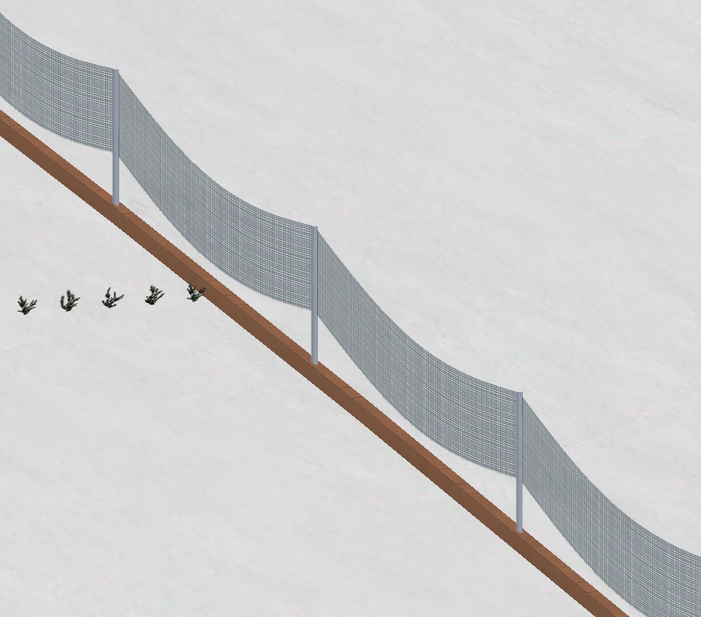
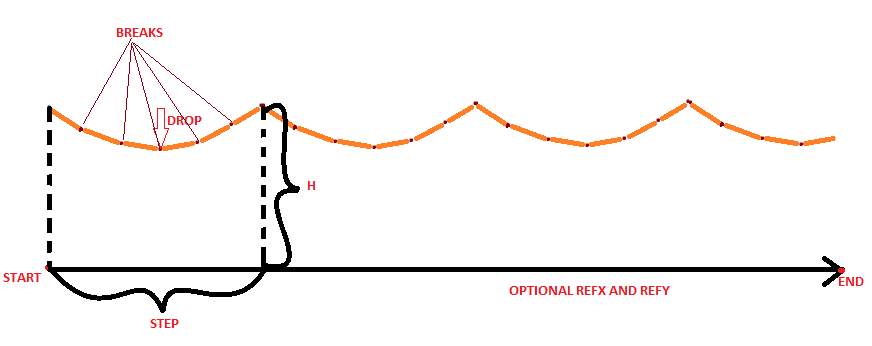

# Create fence profile
This script allow you to create refy fence profile like this

apart from profile which is named 'dhill-fence' script outputs example railing.
## Instruction
All parameters are explained in this picture



## Usage
Example usage: navigate to this folder and launch command below:
```{bash}
python3 create_fence_profile.py \
--start=2 \
--end=100 \
--refy=dhill-top \
--refx=dhill \
--step=1.5 \
--h=1.2 \
--drop=.5 \
--breaks=8 \
--output_xml=test__.xml
```
