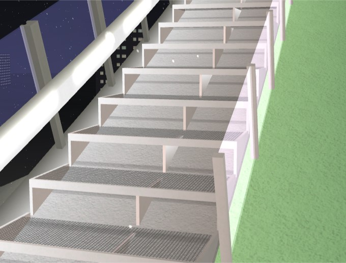

# Create stairs profile

Default ```<stairs...``` allows only to create stairs that are having side coverings adjusted to _y_ profile. This scripts creates profile for stairs like this

and outputs example pillar with _step_ and _count_ parameter adjusted to the whole profile. It can be used as a template to create additional stairs elements like support for stairs etc. It needs to have _lz_ and _rz_ adjusted. And you can definie also _ref[rl]?z_.

## Usage

Script require following arguments:
* refx - refx for stairs profile
* refy- refy for stairs profile
* start- x start coordinate value for stairs
* end- x end coordinate value for stairs
* step- length of one step
* h- height above y profile. It should be at least greater than 0, although value above 0.05 is optimal to avoid flickering(but adjusting zbias should work fine)
* offset- length of 'drop' between stairs in profile. Values in range of 0.001-0.05 are optimal
* output- output file to write in

Example usage: navigate to this folder and launch command below:
```{bash}
python create_stairs_profile.py \
--refx=dhill \
--refy=dhill-top \
--start=5 \
--end=20 \
--step=0.2 \
--h=.04 \
--offset=.01
--output=test_stairs.xml
```
