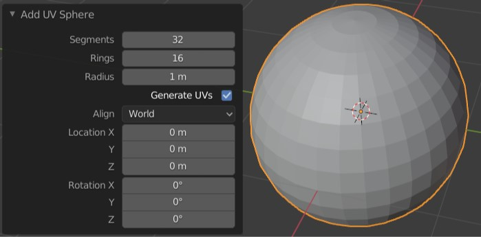

# Create stairs profile

This script allows to create UV sphere using beams instead of space consuming `<3dmodel/>` directive. This script creates UV sphere with the same parameters as used in blender



## Usage

Script require following arguments:
* x - x position of the center of the sphere
* y - y position of the center of the sphere
* z - z position of the center of the sphere
* radius - radius of the sphere
* segments - number of vertical cuts
* rings - number of horizontal cuts. Number of this parameters equals to number of beams generated
* color - colour of the sphere
* output - name of the output file

You can define optional arguments for positioning
* refx - reference for the x axis on which the spere is based on
* refy - reference for the y axis on which the spere is based on
* refz - reference for the z axis on which the spere is based on

Example usage: navigate to this folder and launch command below:
```{bash}
python generate_uv_sphere.py \
--refz="inrun-left" \
--x=-90.191 \
--y=58.712 \
--z=.2 \
--radius=.05 \
--segments=8 \
--rings=12 \
--color=ff0000 \
--output=uv_right
```
