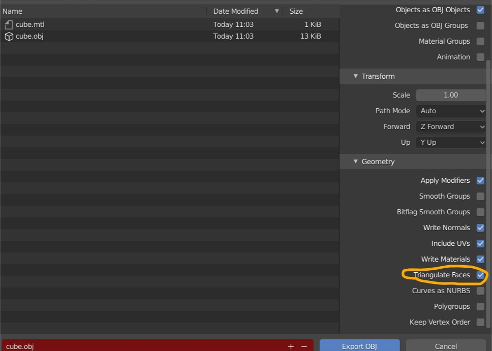
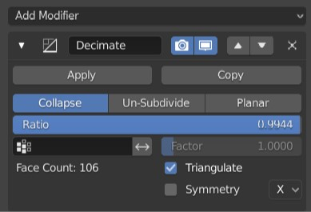
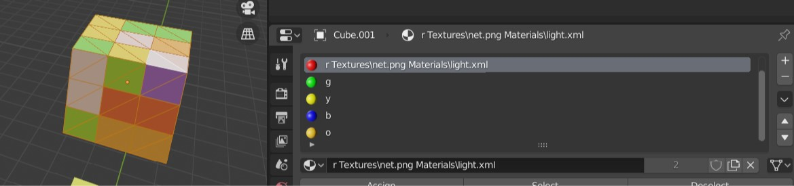
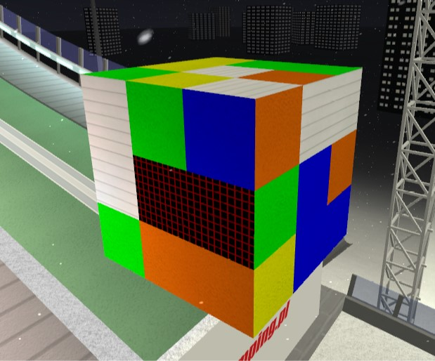

# OBJ to XML _<3dmodel../>_ wrapper

This script allow you to convert OBJ and MTL exported models from blender to xml `<3dmodel...>` code. It separates exported model into batches by assigned materials. It also suppors assigning specific textures and materials by specifying those in material names in blender. This script also extracts UV data from OBJ so you can map the texture on your model in blender's UV editor.

## Prerequisite

* Model needs to be triangulated before export(more about triangulation in next paragraph)
* To extract colours model must have assigned material(for example principled BSDF) with  base color from which converter extracts HEX
* If you specify `Textures\<texture_name>.png`or/and `Materials\<material_name>.xml`, then converter extracts those from material name and assigns those to the batch.

## Model triangulation
Before exporting your model it needs to be triangulated. You can do that in 3 ways:

1. Select *Triangulate Faces* checkbox in export menu under *Geometry* tab:


2. Apply *Decimate* modifier with *triangulate* option. It's the best way if you have model with big vertices count, so you can compress it before exporting to XML




3. Apply *Triangulate* modifier to your model.

## Setting up the materials and textures
You can assign the Texture and Material in material name. If it's not specified correctly(or not specified at all) then it assigns by default `Material\material1.xml` and `Textures\concrete5.png`.


## Setting up the UV mapping
If you create some model from scratch, it's good to check if UV mapping is correct. You can check that in UV editor while being in Edit Mode(Tab) and selecting all the object vertices(a).

## Export instruction
* Make sure, that you have your model selected.

> **tip**: If you have multiple objects, you can merge them into one by selecting all of them in object mode, and then press *ctrl+j*

* File->Export->Wavefront(.obj)
* Select *Selection only* checkbox and set *Z forward* in transform panel
* Export to the folder where the script is located 

## Usage

Script require following arguments:
* input_obj - name of the obj file(without extension)
* output_xml- name of the output file(without extension- it's xml)
* inv_faces- flag which defines if faces should be inverted. If you have model with wrong topology and in DSJ model is fliped(like pillar with lz-rz flipped) then setting this flag to 1 should help
* scale_uv- scale factor for UV mapping. If you have UV mapping well defined in blender, then it should be 1. For value bigger than 1 texture mapped is bigger, for values smaller than 1 texture is smaller.
* model_tag- tag for output xml `<3dmodel`. If your hill is in 1.8.0 version, then you should set this value to `model`

Example usage: navigate to this folder and launch command below:
```{bash}
python obj_wrapper_3d.py\
--input_obj=cube \
--output_xml=cube \
--inv_faces=0 \
--scale_uv=1 \
--model_tag=3dmodel
```

After executing that command, cube.xml file should appear. Copy the content of this file into your hill xml and it should result with this.

